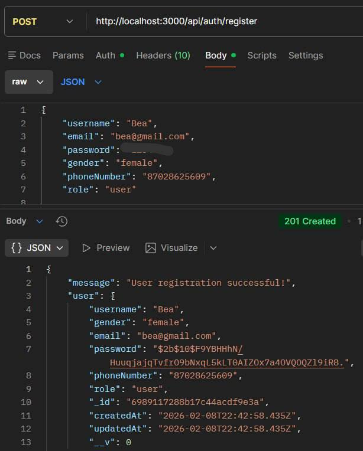
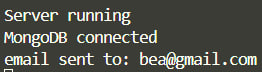
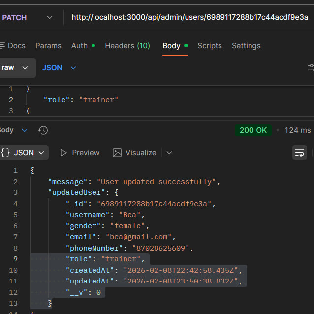
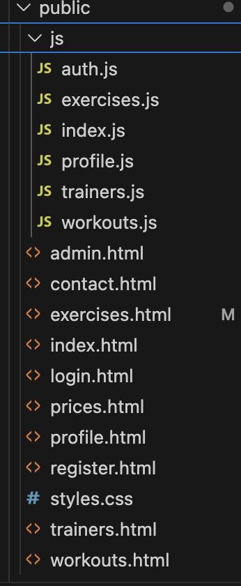
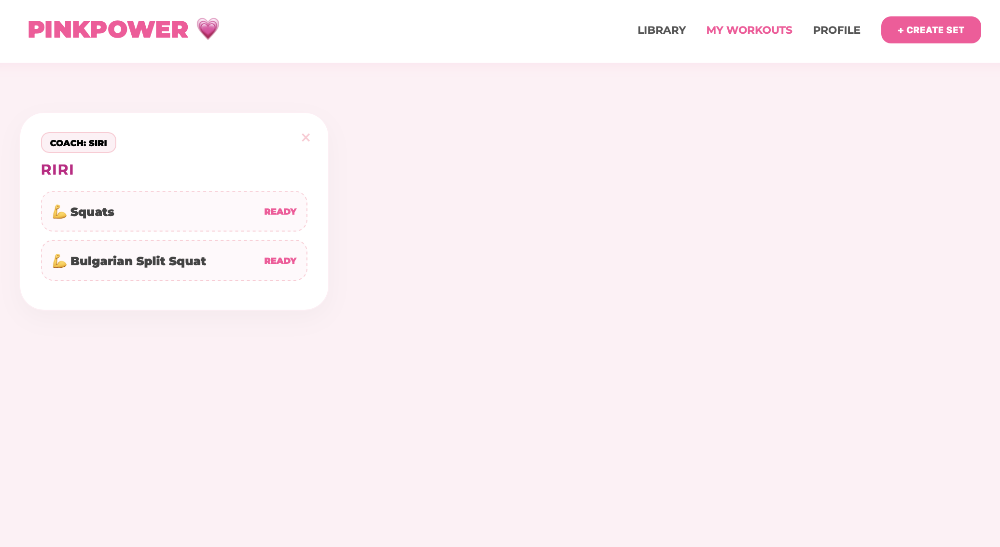
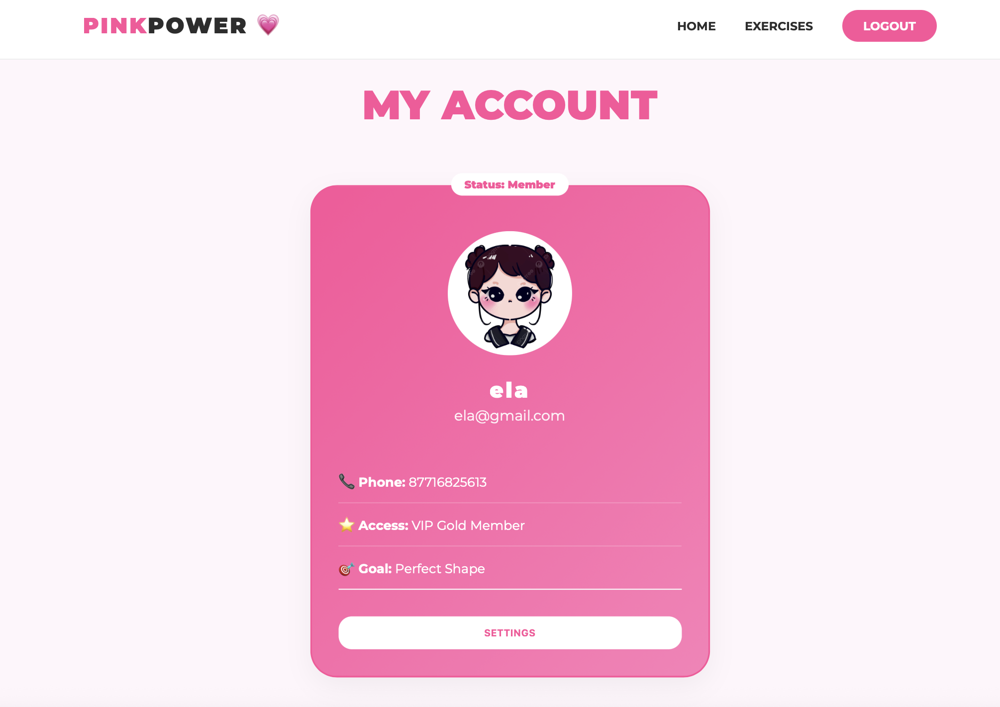

# Pink Power Gym
## Project Overview
Pink Power Gym is a specialized backend service for a female-only fitness community. It provides a secure environment for user registration, authentication via JWT, and administrative user management. This project also featured with the integration of SendGrid SMTP to provide automated email notifications upon successful registration.
## Tech Stack
- Runtime: Node.js
- Framework: Express.js
- Database: MongoDB (Mongoose ODM)
- Mailing: Nodemailer & SendGrid SMTP
- Security: JWT, Bcrypt
## Key features:
- Password hashing with bcrypt and session management via jsonwebtoken
- Role-Based Access Controll, missleware to distinguish between user, trainer, admin roles
- SMTP integration, authomated "Welcome" emails sent via SendGrid
- Validation: strict gender-based registartion logic (femail only) and Mongoose schema validation

## API documentation:
### Public Routes: 
- POST /api/auth/register 
- POST /api/auth/login
- GET /api/trainers /api/trainers/:id
- GET /api/exercises
- GET /api/workouts
### Admin routes:
- PUT /api/admin/users/:id
- GET /api/admin/users
- PUT /api/trainers/:id
- DELETE /api/admin/users/:id /api/admin/trainers/:id
### Trainer routes
- POST /api/exercises
### User routes
- GET & PUT /api/users/profile
- POST /api/workouts
- DELETE /api/workouts/:id
- PUT /api/workouts/:id/exercises
- DELETE /api/workouts/:id/exercises/:exerciseId

## Feature screenshots
### User Registration 
Demonstrates successful user registration. The API validates that the user is female, hashes the password using bcrypt, and saves the record to MongoDB 
 
### Automated welcome email
User receives a formatted HTML email immediately after registration. This is sent via SendGrid’s SMTP relay using a secure STARTTLS connection on Port 587

### Role-Based Access Control
Standard users are blocked from accessing admin/trainer endpoints, ensuring data privacy. Screenshot below demostrates server response when trying to access admin endpoint with user's access token

### Admininstrative management
Administrative functionality allowing the update of user profiles. This uses a PATCH request for partial data modification, following RESTful best practices

# PinkPower Frontend 

## Project Description

This project is the frontend part of the **PinkPower fitness web application**.  
The frontend provides user interaction with the system, including registration, authentication, and access to a personal profile page.

The frontend works with an existing backend API and does not modify backend logic.

---

## Implemented Functionality

The following features were implemented on the frontend:

- User registration via a registration form
- User authentication using JWT
- Automatic redirect to the profile page after successful registration
- Protected profile page (accessible only for authenticated users)
- Display of personal user data:
  - Name
  - Email
  - Phone number
  - User role
- Logout functionality

---

## Authentication Logic

Authentication is handled using **JSON Web Tokens (JWT)**:

1. The user sends registration or login data to the backend.
2. The backend returns a JWT token and user information.
3. The token and user data are stored in `localStorage`.
4. On page load, the frontend checks for the token.
5. If the token is missing, the user is redirected to the login page.

This approach ensures secure access to protected pages.

---

## Technologies Used

- **HTML5** – page structure
- **CSS3** – layout and styling
- **JavaScript (ES6)** – frontend logicdata

No frontend frameworks were used.

---

## Project Structure

## Project Structure

Folder and File Description
/js folder

Contains all client-side JavaScript logic. Each file has a single responsibility.

auth.js
Handles authentication logic:

Saving and retrieving JWT token

Creating authorization headers

Logout functionality

Protecting private pages

index.js
Controls behavior of the main (home) page:

Page initialization

Basic dynamic actions

profile.js
Responsible for the user profile page:

Fetches user data from the backend

Displays username, email, phone number, and role

Redirects unauthenticated users to login

exercises.js
Handles the exercises page:

Fetches exercises from the backend API

Dynamically renders exercise list

trainers.js
Manages trainer-related data:

Fetches trainers from the backend

Displays trainer information

HTML Files

Each HTML file represents a separate page of the website:

index.html — Main landing page

login.html — User login page

register.html — User registration page

profile.html — Personal user profile (protected page)

exercises.html — Exercises catalog

trainers.html — Trainers list

workouts.html — Workout programs

prices.html — Pricing information

contact.html — Contact page

admin.html — Admin panel (restricted access)

styles.css

Contains all global styles for the application:

Layout

Colors

Buttons

Forms

Responsive design

### Workout page

### Main page

### Profile page

### Exercises page

---

## User Roles

All users register in the same way and receive the `user` role by default.  
A user can be promoted to `trainer` by an admin using backend endpoints.  
The frontend adjusts the interface based on the user role.

---
